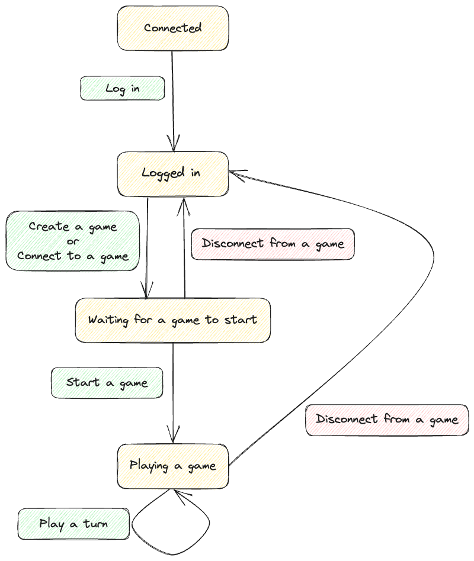

This is a description of the web sockets server API.
On the diagram you can see transitions between states a user might be in.
In the [second part](#message-formats) you can see a format of each message 
that is either [expected from a client](#client-sent-messages) or [sent to the client](#server-sent-messages) from the server.

# Contents

- [User flow overview](#user-flow-overview)
- [Message formats](#message-formats)
   * [Server sent messages](#server-sent-messages)
      + [Initiating connection to the server responses](#initiating-connection-to-the-server-responses)
         - [Log in successful](#log-in-successful)
         - [Log in failed](#log-in-failed)
         - [Unexpected first message](#unexpected-first-message)
      + [Creating a game responses](#creating-a-game-responses)
         - [Game created successfully](#game-created-successfully)
         - [Game creation error](#game-creation-error)
      + [Connecting into an existing game responses](#connecting-into-an-existing-game-responses)
         - [Successful connect](#successful-connect)
         - [Connecting to game error](#connecting-to-game-error)
      + [Disconnecting from a game responses](#disconnecting-from-a-game-responses)
         - [Successful disconnect](#successful-disconnect)
         - [Disconnect from game error](#disconnect-from-game-error)
      + [Starting a game responses](#starting-a-game-responses)
         - [Successful game start](#successful-game-start)
         - [Game start error](#game-start-error)
      + [Playing a turn response](#playing-a-turn-response)
         - [Successful turn result](#successful-turn-result)
         - [Error when playing a turn](#error-when-playing-a-turn)
         - [Game ended turn result](#game-ended-turn-result)
      + [Invalid message error](#invalid-message-error)
   * [Client sent messages](#client-sent-messages)
      + [Initiating connection to the server](#initiating-connection-to-the-server)
         - [Log in message](#log-in-message)
      + [Creating a game](#creating-a-game)
      + [Connecting to an existing game](#connecting-to-an-existing-game)
      + [Disconnecting from a game](#disconnecting-from-a-game)
      + [Starting a game](#starting-a-game)
      + [Playing a turn](#playing-a-turn)
         - [Skip turn](#skip-turn)
         - [Draw cards](#draw-cards)
         - [Play a card](#play-a-card)

# User flow overview



# Message formats

## Server sent messages

All the server-sent messages include a property `type` which you can use to determine the context of the message.
Furthermore, a lot of messages have a successful variant that has a property `success` set to `true` and some other properties that you can discover below.
Another common variant is an error message.
This signals that either the [message itself is invalid](#invalid-message-error) or that it came with incorrect parameters or at an incorrect time (e.g. it is not your turn).

In the end there are two properties that uniquely identify each message, `type` and (the presence of either `error` or `success`).

### Initiating connection to the server responses

#### Log in successful

Success message
* In response to the [login message](#log-in-message)
* Fields:
  * `availableGameIds` - list of all created games currently on the server
* Audience: sender of the login message
```json
{ "type": "logIn"
, "success": true
, "availableGameIds": ["<gameId1>", "<gameId2>"]
}
```

#### Log in failed

Error message
* In response to the [login message](#log-in-message)
* Audience: sender of the login message
```json
{ "type": "logIn"
, "error": "<description of the occurred error>"
}
```

#### Unexpected first message

Error sent back when the first message a client sends is not the [login message](#log-in-message).
* In response to any message apart from the [login message](#log-in-message) at the start of the connection
* Audience: sender of the login message
```json
{ "type": "handshake"
, "error": "Provide your userName before other interaction."
}
```

### Creating a game responses

#### Game created successfully

Success message
* In response to the [create a game message](#creating-a-game)
* Audience: all connected users

```json
{ "type": "gameCreation"
, "success": true
, "gameId": "<id of the created game>"
, "creator": "<username of the user that created the name>"
}
```

#### Game creation error

Error message
* In response to the [create a game message](#creating-a-game)
* Audience: sender of the message

```json
{ "type": "gameCreation"
, "error": "<description of the occurred error>"
}
```

### Connecting into an existing game responses

#### Successful connect

Success message
* In response to the [connect to an existing game message](#connecting-to-an-existing-game)
* Fields:
  * `usersInGame` - usernames of all users connected to the game (including the sender)
* Audience: players connected to the game (including the sender)
```json
{ "type": "connectToGame"
, "success": true
, "gameId": "<id of the game into which the sender connected>"
, "userName": "<username of the sender>"
, "usersInGame": ["<userName1>", "<userName2>"]
}
```

#### Connecting to game error

Error message
* In response to the [connect to an existing game message](#connecting-to-an-existing-game)
* Audience: sender of the message
```json
{ "type": "connectToGame"
, "error": "<description of the occurred error>"
}
```

### Disconnecting from a game responses

#### Successful disconnect

Success message
* In response to the [disconnect from a game message](#disconnecting-from-a-game)
* Audience: all connected users
```json
{ "type": "disconnectFromGame"
, "success": true
, "gameStatusAfterDisconnect": "<remains or removed>"
, "userName": "<username of the sender (the disconnected user)>"
, "gameId": "<id of the game the sender disconnected from>"
}
```

#### Disconnect from game error

Error message
* In response to the [disconnect from a game message](#disconnecting-from-a-game)
* Audience: sender of the message
```json
{ "type": "disconnectFromGame",
, "error": "<description of the occurred error>"
}
```

### Starting a game responses

#### Successful game start

Success message
* In response to the [start a game message](#starting-a-game)
* Audience: players of the game
```json5
{ "type": "startGame"
, "success": true
, "state": GameState
}
```

#### Game start error

Error message
* In response to the [disconnect from a game message](#disconnecting-from-a-game)
* Audience: sender of the message
```json
{ "type": "startGame"
, "error": "<description of the occurred error>"
}
```

### Playing a turn response

#### Successful turn result

Success message
* In response to the [play a turn message](#playing-a-turn)
* Audience: players of the game
```json5
{ "type": "turn"
, "success": true
, "state": GameState
}
```

#### Error when playing a turn

Error message
* In response to the [play a turn message](#playing-a-turn)
* Audience: sender of the message
```json
{ "type": "turn"
, "error": "<description of the occurred error>"
}
```

#### Game ended turn result

Success message
* In response to the [play a turn message](#playing-a-turn)
* Audience: players of the game
```json5
{ "type": "gameEnded"
, "state": GameState
}
```

### Invalid message error

This is a general error sent when the message provided by client is invalid (e.g. missing a required property or invalid json).
* In response to any invalid message
* Audience: sender of the message
```json
{ "type": "error"
, "error": "<description of the occurred error>"
}
```

## Client sent messages

All messages from the client must include a property `type`.
This property indicates what type of message this is and what other properties will the server expect.

### Initiating connection to the server

#### Log in message

You need to send this as the first message when starting a communication with the server.
The provided `userName` uniquely identifies the connection and therefore duplicate user names will be [rejected](#log-in-failed) by the server.

```json
{ "type": "logIn"
, "userName": "<chosenUserName>"
}
```

### Creating a game

Send this message when you want to create a new game.

```json
{ "type": "createGame"
}
```

### Connecting to an existing game

Send this message when you want to connect to an existing game.
The game must not be started yet.

```json
{ "type": "connectToGame"
, "gameId": "<id of the game into which you want to connect>"
}
```

### Disconnecting from a game

Send this message to disconnect from a game.
You can disconnect from a running game making the game pending waiting for you to reconnect.
If you are the last player in the game, the game is deleted.

```json
{ "type": "disconnectFromGame"
}
```

### Starting a game

Send this message to start a game that you created.
There must be at least one other player for you to be able to start the game.

```json
{ "type": "startGame"
}
```

### Playing a turn

Send one of these messages to play a turn when it is your turn.

#### Skip turn

Only play send this when there is an active ace on top of the discard pile and you can't/don't want to play an ace.
```json
{ "type": "skipTurn"
}
```

#### Draw cards

Play this when you don't have anything to play (Or don't want to play anything) to draw one card.
Alternatively, you can also play this when there is an active seven on top of the discard pile to draw the appropriate amount of cards.
```json
{ "type": "drawCards"
}
```

#### Play a card

Play this when you want to play a card.

Fields:
  * `chosenSuite` - This field is required only when you play a queen.
```json5
{ "type": "playCard"
, "card": Card
, "chosenSuite": Suite
}
```
